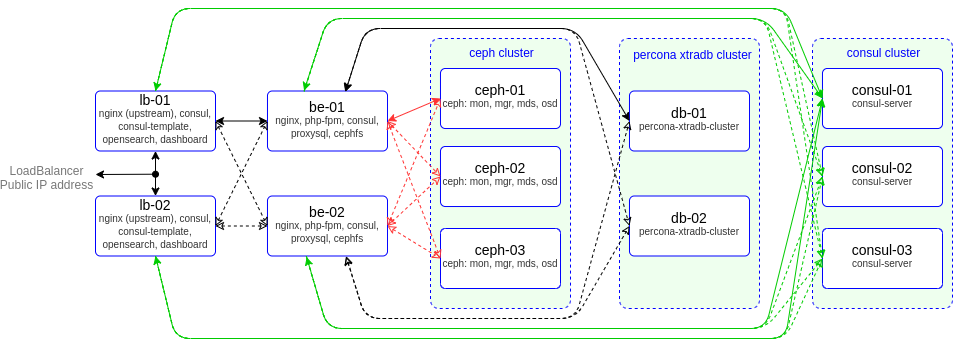
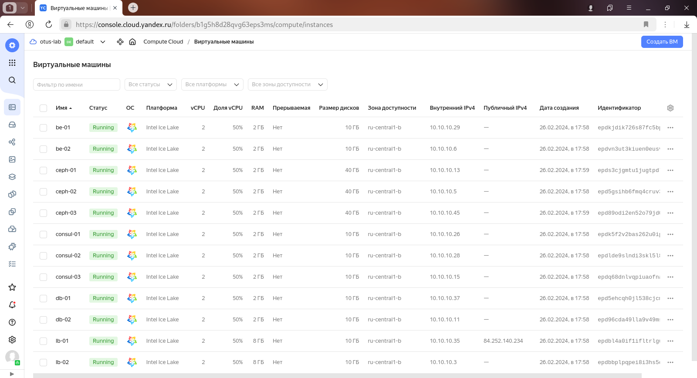

# project
otus | project admin linux advanced

### Домашнее задание
настройка CEPH

#### Цель:
Построить отказоустойчивый кластер виртуализации для запуска современных сервисов, рассчитанных под высокую нагрузку

#### Описание/Пошаговая инструкция выполнения домашнего задания:
За основу берётся веб-проект — это может быть CMS (например, Wordpress) или веб-проекты коллег с других курсов;
Выполняется кластеризация и балансировка веб-сервера и СУБД (MySQL, PostgreSQL — на выбор);
Требования к реализации:
- terraform для развертывания в облаке (AH, yandex cloud, gcp)
- Ansible/Salt/Chef - для развертывания

В итоге в проект должны быть включены:
- как минимум 2 узла с СУБД;
- минимум 2 узла с веб-серверами;
- настройка межсетевого экрана (запрещено всё, что не разрешено);
- скрипты резервного копирования;
- центральный сервер сбора логов (ELK).
- мониторинг - Prometheus

Для реализации кластера можно использовать такие технологии, как
* pacemaker+corosync/hearbeat
* kubernetes
* nomad
* opennebula/openstack
* HAproxy, VRRP
* CEPH
* Consul
* кластерные решения для СУБД.

В конце курса мы проведем итоговое занятие по проекту. На занятии мы обсудим вопросы, возникшие в процессе работы.

#### Критерии оценки:
Работа считается выполненной, если в проект включены:
- как минимум 2 узла с СУБД;
- минимум 2 узла с веб-серверами;
- настройка межсетевого экрана (запрещено всё, что не разрешено);
- скрипты резервного копирования;
- центральный сервер сбора логов (ELK).
- мониторинг - Prometheus

---

### ПРОЕКТ

Стенд будем разворачивать с помощью Terraform на YandexCloud, настройку серверов будем выполнять с помощью Ansible.

Необходимые файлы размещены в репозитории GitHub по ссылке:
```
https://github.com/SergSha/project3.git
```
Схема:



Для начала получаем OAUTH токен:
```
https://cloud.yandex.ru/docs/iam/concepts/authorization/oauth-token
```

Настраиваем аутентификации в консоли:
```bash
export YC_TOKEN=$(yc iam create-token)
export TF_VAR_yc_token=$YC_TOKEN
```

Скачиваем проект с гитхаба:
```bash
git clone https://github.com/SergSha/project3.git && cd ./project3
```

В файле input.auto.tfvars нужно вставить свой 'cloud_id':
```bash
cloud_id  = "..."
```

Ceph кластер будем разворачивать с помощью Terraform, а все установки и настройки необходимых приложений будем реализовывать с помощью Ansible.

Для того чтобы развернуть ceph кластер, нужно выполнить следующую команду:
```bash
terraform init && terraform apply -auto-approve && \
sleep 60 && ansible-playbook ./provision.yml \
--extra-vars "admin_password=admin@Otus1234 \
kibanaserver_password=kibana@Otus1234 \
logstash_password=logstash@Otus1234"
```

По завершению команды получим данные outputs:
```
Outputs:

bes-info = {
  "be-01" = {
    "ip_address" = tolist([
      "10.10.10.16",
    ])
    "nat_ip_address" = tolist([
      "",
    ])
  }
  "be-02" = {
    "ip_address" = tolist([
      "10.10.10.9",
    ])
    "nat_ip_address" = tolist([
      "",
    ])
  }
}
cephs-info = {
  "ceph-01" = {
    "ip_address" = tolist([
      "10.10.10.15",
    ])
    "nat_ip_address" = tolist([
      "",
    ])
  }
  "ceph-02" = {
    "ip_address" = tolist([
      "10.10.10.14",
    ])
    "nat_ip_address" = tolist([
      "",
    ])
  }
  "ceph-03" = {
    "ip_address" = tolist([
      "10.10.10.35",
    ])
    "nat_ip_address" = tolist([
      "",
    ])
  }
}
consuls-info = {
  "consul-01" = {
    "ip_address" = tolist([
      "10.10.10.29",
    ])
    "nat_ip_address" = tolist([
      "",
    ])
  }
  "consul-02" = {
    "ip_address" = tolist([
      "10.10.10.18",
    ])
    "nat_ip_address" = tolist([
      "",
    ])
  }
  "consul-03" = {
    "ip_address" = tolist([
      "10.10.10.32",
    ])
    "nat_ip_address" = tolist([
      "",
    ])
  }
}
dbs-info = {
  "db-01" = {
    "ip_address" = tolist([
      "10.10.10.36",
    ])
    "nat_ip_address" = tolist([
      "",
    ])
  }
  "db-02" = {
    "ip_address" = tolist([
      "10.10.10.3",
    ])
    "nat_ip_address" = tolist([
      "",
    ])
  }
}
lbs-info = {
  "lb-01" = {
    "ip_address" = tolist([
      "10.10.10.8",
    ])
    "nat_ip_address" = tolist([
      "158.160.83.34",
    ])
  }
  "lb-02" = {
    "ip_address" = tolist([
      "10.10.10.34",
    ])
    "nat_ip_address" = tolist([
      "",
    ])
  }
}
loadbalancer-info = [
  {
    "attached_target_group" = toset([
      {
        "healthcheck" = tolist([
          {
            "healthy_threshold" = 2
            "http_options" = tolist([])
            "interval" = 2
            "name" = "tcp"
            "tcp_options" = tolist([
              {
                "port" = 80
              },
            ])
            "timeout" = 1
            "unhealthy_threshold" = 2
          },
        ])
        "target_group_id" = "enpnbjm6sq7cj4jbbds6"
      },
      {
        "healthcheck" = tolist([
          {
            "healthy_threshold" = 2
            "http_options" = tolist([])
            "interval" = 2
            "name" = "tcp"
            "tcp_options" = tolist([
              {
                "port" = 8443
              },
            ])
            "timeout" = 1
            "unhealthy_threshold" = 2
          },
        ])
        "target_group_id" = "enpug6u3istvke97b2p2"
      },
    ])
    "created_at" = "2024-02-19T12:03:00Z"
    "deletion_protection" = false
    "description" = ""
    "folder_id" = "b1g5h8d28qvg63eps3ms"
    "id" = "enptl3sk18857c6u0crv"
    "labels" = tomap({})
    "listener" = toset([
      {
        "external_address_spec" = toset([
          {
            "address" = "158.160.149.25"
            "ip_version" = "ipv4"
          },
        ])
        "internal_address_spec" = toset([])
        "name" = "ceph-dashboard-listener"
        "port" = 8443
        "protocol" = "tcp"
        "target_port" = 8443
      },
      {
        "external_address_spec" = toset([
          {
            "address" = "158.160.149.25"
            "ip_version" = "ipv4"
          },
        ])
        "internal_address_spec" = toset([])
        "name" = "opensearch-dashboard-listener"
        "port" = 5601
        "protocol" = "tcp"
        "target_port" = 5601
      },
      {
        "external_address_spec" = toset([
          {
            "address" = "158.160.149.25"
            "ip_version" = "ipv4"
          },
        ])
        "internal_address_spec" = toset([])
        "name" = "web-listener"
        "port" = 80
        "protocol" = "tcp"
        "target_port" = 80
      },
    ])
    "name" = "mylb"
    "network_load_balancer_id" = "enptl3sk18857c6u0crv"
    "region_id" = "ru-central1"
    "type" = "external"
  },
]
```

На всех серверах будут установлены ОС Almalinux 9, настроены синхронизация времени Chrony, система принудительного контроля доступа SELinux по рекомендации из документации Ceph для быстрой установки и настройки ceph кластера переведён в Permissive, в качестве firewall будет использоваться NFTables.

Список виртуальных машин после запуска стенда:



Ceph кластер будет состоять из следующих серверов:
- мониторы (тут же и менеджеры): mon-01, mon-02, mon-03;
- сервер метаданных: mds-01;
- OSD: osd-01, osd-02, osd-03.

Также будут подготовлены:
- клиентский сервер client-01 для подключения к ceph кластеру;
- сервер osd-04 для замены одного из osd серверов.

Все osd сервера имеют по три дополнительных диска по 10 ГБ:
- vdb, vdc - которые будут включены в кластер во время разворачивания;
- vdd - для дополнительного включения в кластер при выполнении лабораторной работы.