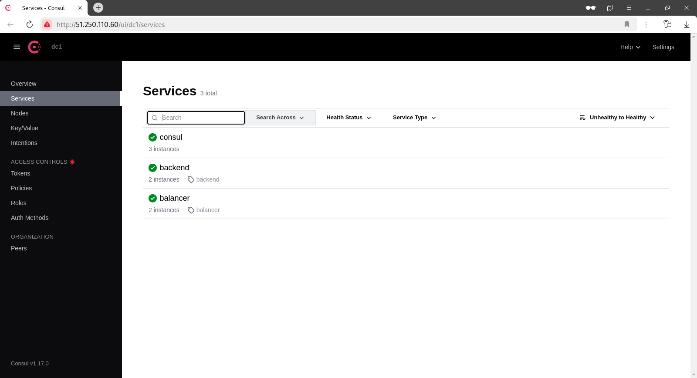

# project
otus | project of admin linux advanced

Проектная работа

#### Цель:
Построить отказоустойчивый кластер виртуализации для запуска современных сервисов, рассчитанных под высокую нагрузку

#### Описание/Пошаговая инструкция выполнения домашнего задания:
За основу берётся веб-проект — это может быть CMS (например, Wordpress) или веб-проекты коллег с других курсов;
Выполняется кластеризация и балансировка веб-сервера и СУБД (MySQL, PostgreSQL — на выбор);
Требования к реализации:
- terraform для развертывания в облаке (AH, yandex cloud, gcp)
- Ansible/Salt/Chef - для развертывания

В итоге в проект должны быть включены:
- как минимум 2 узла с СУБД;
- минимум 2 узла с веб-серверами;
- настройка межсетевого экрана (запрещено всё, что не разрешено);
- скрипты резервного копирования;
- центральный сервер сбора логов (ELK).
- мониторинг - Prometheus

Для реализации кластера можно использовать такие технологии, как
* pacemaker+corosync/hearbeat
* kubernetes
* nomad
* opennebula/openstack
* HAproxy, VRRP
* CEPH
* Consul
* кластерные решения для СУБД.

В конце курса мы проведем итоговое занятие по проекту. На занятии мы обсудим вопросы, возникшие в процессе работы.

#### Критерии оценки:
Работа считается выполненной, если в проект включены:
- как минимум 2 узла с СУБД;
- минимум 2 узла с веб-серверами;
- настройка межсетевого экрана (запрещено всё, что не разрешено);
- скрипты резервного копирования;
- центральный сервер сбора логов (ELK).
- мониторинг - Prometheus

---

### ПРОЕКТ
#### "Создание высокодоступной инфраструктуры для web-приложения в Yandex.Cloud"

Стенд будем разворачивать с помощью Terraform на YandexCloud, настройку серверов будем выполнять с помощью Ansible.

Необходимые файлы размещены в репозитории GitHub по ссылке:
```
https://github.com/SergSha/project3.git
```
Схема:


Для начала получаем OAUTH токен:
```
https://cloud.yandex.ru/docs/iam/concepts/authorization/oauth-token
```

Настраиваем аутентификации в консоли:
```bash
export YC_TOKEN=$(yc iam create-token)
export TF_VAR_yc_token=$YC_TOKEN
```

Скачиваем проект с гитхаба:
```bash
git clone https://github.com/SergSha/project3.git && cd ./project3
```

В файле input.auto.tfvars нужно вставить свой 'cloud_id':
```bash
cloud_id  = "..."
```

Инфраструктуру будем разворачивать с помощью Terraform, а все установки и настройки необходимых приложений будем реализовывать с помощью Ansible.

Для того чтобы развернуть инфраструктуру, нужно выполнить следующую команду:
```bash
terraform init && terraform apply -auto-approve && \
sleep 60 && ansible-playbook ./provision.yml \
--extra-vars "admin_password=admin@Otus1234 \
kibanaserver_password=kibana@Otus1234 \
logstash_password=logstash@Otus1234"
```

По завершению команды получим данные outputs:
```
Outputs:

bes-info = {
  "be-01" = {
    "ip_address" = tolist([
      "10.10.10.7",
    ])
    "nat_ip_address" = tolist([
      "",
    ])
  }
  "be-02" = {
    "ip_address" = tolist([
      "10.10.10.5",
    ])
    "nat_ip_address" = tolist([
      "",
    ])
  }
}
cephs-info = {
  "ceph-01" = {
    "ip_address" = tolist([
      "10.10.10.8",
    ])
    "nat_ip_address" = tolist([
      "",
    ])
  }
  "ceph-02" = {
    "ip_address" = tolist([
      "10.10.10.30",
    ])
    "nat_ip_address" = tolist([
      "",
    ])
  }
  "ceph-03" = {
    "ip_address" = tolist([
      "10.10.10.3",
    ])
    "nat_ip_address" = tolist([
      "",
    ])
  }
}
consuls-info = {
  "consul-01" = {
    "ip_address" = tolist([
      "10.10.10.23",
    ])
    "nat_ip_address" = tolist([
      "",
    ])
  }
  "consul-02" = {
    "ip_address" = tolist([
      "10.10.10.38",
    ])
    "nat_ip_address" = tolist([
      "",
    ])
  }
  "consul-03" = {
    "ip_address" = tolist([
      "10.10.10.24",
    ])
    "nat_ip_address" = tolist([
      "",
    ])
  }
}
dbs-info = {
  "db-01" = {
    "ip_address" = tolist([
      "10.10.10.26",
    ])
    "nat_ip_address" = tolist([
      "",
    ])
  }
  "db-02" = {
    "ip_address" = tolist([
      "10.10.10.32",
    ])
    "nat_ip_address" = tolist([
      "",
    ])
  }
}
lbs-info = {
  "lb-01" = {
    "ip_address" = tolist([
      "10.10.10.39",
    ])
    "nat_ip_address" = tolist([
      "158.160.10.39",
    ])
  }
  "lb-02" = {
    "ip_address" = tolist([
      "10.10.10.36",
    ])
    "nat_ip_address" = tolist([
      "",
    ])
  }
}
loadbalancer-info = {
  "opensearch-dashboard-listener" = {
    "ip_address" = toset([
      {
        "address" = "158.160.138.160"
        "ip_version" = "ipv4"
      },
    ])
    "port" = 5601
  }
  "web-listener" = {
    "ip_address" = toset([
      {
        "address" = "158.160.138.160"
        "ip_version" = "ipv4"
      },
    ])
    "port" = 80
  }
}
```

На всех серверах будут установлены ОС Almalinux 9, настроены синхронизация времени Chrony, система принудительного контроля доступа SELinux, в качестве firewall будет использоваться NFTables.

Список виртуальных машин после запуска стенда:


Инфраструктура состоит из следующих серверов:
- балансировщики нагрузок: lb-01, lb-02;
- бэкенды: be-01, be-02
- ceph-сервера: ceph-01, ceph-02, ceph-03 - Ceph кластер;
- сервера базы данных MySQL: db-01, db-02 - MySQL кластер;
- consul-сервера: consul-01, consul-02, consul-03 - Consul кластер.

На балансировщиках (lb-01, lb-02) установлены и настроены в режиме upstream nginx, consul клиентской версии и consul-template. Пакеты распределяются между бэкендами (be-01, be-02) методом round robin. В случае отказа одного из бэкендов consul-template динамически подменяет конфигурационные файлы nginx, что все пакеты будут распределяться между оставшимися в строе бэкендами.

На бэкендах (be-01, be-02) установлены и настроены nginx, php-fpm, proxysql, consul клиентской версии и ceph. К каталогу /var/www/, в котором хранятся файлы web-страницы, примонтировано общее файловое хранилище Ceph-кластера в файловой системе CephFS.
Proxysql служит балансировщиком нагрузки для распределения пакетов между серверами кластера базы данных MySQL (db-01, db-02). 

Кластер базы данных MySQL состоит из двух нод db-01, db-02. На этих нодах установлены и настроены Percona XtraDB Cluster. Работоспособность кластера базы данных MySQL сохраняется при отказе одной из двух нод.

Ceph-кластер состоит из трёх нод ceph-01, ceph-02, ceph-03. В нашем случае все эти ноды являются и мониторами, и менеджерами, и серверами метаданных, и OSD. Все ceph-сервера имеют по три дополнительных диска по 10 ГБ: vdb, vdc, vdd. При планировании создания ceph-кластера необходимо было рассчитать общее число групп размещения для кластер Ceph на пул по следующей формуле:
```
Total PGs = (Total_number_of_OSD * %_data * Target_PGs_per_OSD) / max_replication_count / pool_count

Total_number_of_OSD - количество OSDs, в которых этот пул будет иметь PGS. Обычно это количество OSDs всего кластера, но может быть меньше в зависимости от правил CRUSH. (например, отдельные наборы дисков SSD и SATA). 

%_data - это значение представляет приблизительный процент данных, которые будут содержаться в этом пуле для данного конкретного OSDs. 

Target PGs per OSD - это значение должно быть заполнено на основе следующего указания:
    100 - если количество OSDs кластера, как ожидается, не увеличится в обозримом будущем.
    200 - если ожидается, что количество OSDs кластера увеличится (до удвоения размера) в обозримом будущем.
    300 - если ожидается, что количество OSDs кластера увеличится в 2-3 раза в обозримом будущем.

max_replication_count - количество реплик, которые будут находиться в пуле. Значение, по умолчанию, равно 3.

pool_count - количество пулов в кластере Ceph.
```

В нашем случае:
```
Total_number_of_OSD = 9 (три сервера, каждый который имеет по три диска 10 ГБ);

%_data = 1 (будем использовать пространство хранилища в полном объёме);

Target_PGs_per_OSD = 100;

max_replication_count = 3 (оставляем по умолчанию);

pool_count = 3 (У нас будет три пула: .mgr, ceph_data, ceph_meta).
```

итого получаем:
```
Total PGs = (9 * 1 * 100) / 3 / 3 = 100 => 128 pg
```
На базе этого расчёта и была создана файловая система CephFS, которая в последующем монтируется к бэкендам (be-01, be-02) в качестве общего хранилища для размещения файлов web-страниц.
Работоспособность Ceph-кластера остаётся при отказе одной из трёх нод.

Consul-кластер был развёрнут на трёх нодах consul-01, consul-02, consul-03. На них установлены и настроены consul-cerver. Проверка (check) на доступность сервисов на клиентских серверах (lb-01, lb-02, be-01, be-02) осуществляется по http. Работоспособность Consul-кластера сохраняется при отказе одной из трёх нод. 

Визуализация работы Consul осуществляется с помощью Consul Dashboard путем отображения в браузере:



Для проверки работы инфраструктуры воспользуемся отображением простой страницы собственноручно созданного сайта на PHP, имитирующий продажу новых и подержанных автомобилей. 

Введём в адресной строке браузера публичный ip адрес балансировщика от YandexCloud, получим следующую web-страницу:


Проверим работу сайта, наполняя данные полей:


и так далее:


При напонении сайта данные будут размещаться в базе данных mysql-кластера (db-01, db-02).

На балансировщиках (lb-01, lb-02) также реализован централизованный сбор логов - OpenSearch.

В данном случае с балансировщиков (lb-01, lb-02) и бэкендов (be-01, be-02) для статического хранения файлов сайта будем собирать логи работы nginx, а с серверов хранения баз данных (db-01, db-02) - логи mysql.

Для сбора логов со всех серверов используется Logstash, которые передают логи в свою очередь OpenSearch. Устанавлены на тех же серверах, где и OpenSearch, то есть lb-01, lb-02.

В качестве агентов для передачи логов на всех серверах установлены FileBeat.

Для визуализации данных логов будет использоваться OpenSearch Dashboard. В данном случае OpenSearch Dashboard для удобства установлены на серверах-балансировщиках (lb-01, lb-02).


В данном проекте также реализован мониторинг всех серверов инфраструктуры. Для этого на серверах lb-01 и lb-02 устанволены Prometheus. В качестве агентов для сбора данных на всех серверах установлены Node_exporter. Для визуализации используется Grafana, установленная и настроенная на двух серверах (lb-01, lb-02):


#### Удаление развёрнутой инфраструктуры

Удалить развернутую инфраструктуру с помощью следующей команды:
```bash
terraform destroy -auto-approve
```
