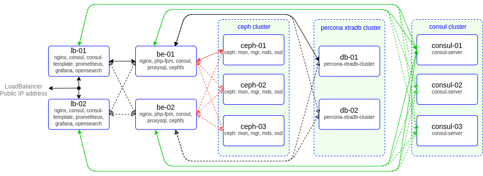

# project
otus | project admin linux advanced

### Домашнее задание
настройка CEPH

#### Цель:
Построить отказоустойчивый кластер виртуализации для запуска современных сервисов, рассчитанных под высокую нагрузку

#### Описание/Пошаговая инструкция выполнения домашнего задания:
За основу берётся веб-проект — это может быть CMS (например, Wordpress) или веб-проекты коллег с других курсов;
Выполняется кластеризация и балансировка веб-сервера и СУБД (MySQL, PostgreSQL — на выбор);
Требования к реализации:
— terraform для развертывания в облаке (AH, yandex cloud, gcp)
— Ansible/Salt/Chef - для развертывания

В итоге в проект должны быть включены:
— как минимум 2 узла с СУБД;
— минимум 2 узла с веб-серверами;
— настройка межсетевого экрана (запрещено всё, что не разрешено);
— скрипты резервного копирования;
— центральный сервер сбора логов (ELK).
— мониторинг - Prometheus

Для реализации кластера можно использовать такие технологии, как
* pacemaker+corosync/hearbeat
* kubernetes
* nomad
* opennebula/openstack
* HAproxy, VRRP
* CEPH
* Consul
* кластерные решения для СУБД.

В конце курса мы проведем итоговое занятие по проекту. На занятии мы обсудим вопросы, возникшие в процессе работы.

#### Критерии оценки:
Работа считается выполненной, если в проект включены
— как минимум 2 узла с СУБД;
— минимум 2 узла с веб-серверами;
— настройка межсетевого экрана (запрещено всё, что не разрешено);
— скрипты резервного копирования;
— центральный сервер сбора логов (ELK).
— мониторинг - Prometheus

---

### ПРОЕКТ

Стенд будем разворачивать с помощью Terraform на YandexCloud, настройку серверов будем выполнять с помощью Ansible.

Необходимые файлы размещены в репозитории GitHub по ссылке:
```
https://github.com/SergSha/project3.git
```
Схема:



Для начала получаем OAUTH токен:
```
https://cloud.yandex.ru/docs/iam/concepts/authorization/oauth-token
```

Настраиваем аутентификации в консоли:
```bash
export YC_TOKEN=$(yc iam create-token)
export TF_VAR_yc_token=$YC_TOKEN
```

Скачиваем проект с гитхаба:
```bash
git clone https://github.com/SergSha/project3.git && cd ./project3
```

В файле input.auto.tfvars нужно вставить свой 'cloud_id':
```bash
cloud_id  = "..."
```

Ceph кластер будем разворачивать с помощью Terraform, а все установки и настройки необходимых приложений будем реализовывать с помощью Ansible.

Для того чтобы развернуть ceph кластер, нужно выполнить следующую команду:
```bash
terraform init && terraform apply -auto-approve && \
sleep 60 && ansible-playbook ./provision.yml
```

По завершению команды получим данные outputs:
```
Outputs:

client-info = {
  "client-01" = {
    "ip_address" = tolist([
      "10.10.10.32",
    ])
    "nat_ip_address" = tolist([
      "",
    ])
  }
}
mds-info = {
  "mds-01" = {
    "ip_address" = tolist([
      "10.10.10.18",
    ])
    "nat_ip_address" = tolist([
      "",
    ])
  }
}
mon-info = {
  "mon-01" = {
    "ip_address" = tolist([
      "10.10.10.11",
    ])
    "nat_ip_address" = tolist([
      "84.201.167.133",
    ])
  }
  "mon-02" = {
    "ip_address" = tolist([
      "10.10.10.31",
    ])
    "nat_ip_address" = tolist([
      "",
    ])
  }
  "mon-03" = {
    "ip_address" = tolist([
      "10.10.10.20",
    ])
    "nat_ip_address" = tolist([
      "",
    ])
  }
}
osd-info = {
  "osd-01" = {
    "ip_address" = tolist([
      "10.10.10.28",
    ])
    "nat_ip_address" = tolist([
      "",
    ])
  }
  "osd-02" = {
    "ip_address" = tolist([
      "10.10.10.23",
    ])
    "nat_ip_address" = tolist([
      "",
    ])
  }
  "osd-03" = {
    "ip_address" = tolist([
      "10.10.10.12",
    ])
    "nat_ip_address" = tolist([
      "",
    ])
  }
  "osd-04" = {
    "ip_address" = tolist([
      "10.10.10.21",
    ])
    "nat_ip_address" = tolist([
      "",
    ])
  }
}
```

На всех серверах будут установлены ОС Almalinux 9, настроены синхронизация времени Chrony, система принудительного контроля доступа SELinux по рекомендации из документации Ceph для быстрой установки и настройки ceph кластера переведён в Permissive, в качестве firewall будет использоваться NFTables.

Список виртуальных машин после запуска стенда:


Ceph кластер будет состоять из следующих серверов:
- мониторы (тут же и менеджеры): mon-01, mon-02, mon-03;
- сервер метаданных: mds-01;
- OSD: osd-01, osd-02, osd-03.

Также будут подготовлены:
- клиентский сервер client-01 для подключения к ceph кластеру;
- сервер osd-04 для замены одного из osd серверов.

Все osd сервера имеют по три дополнительных диска по 10 ГБ:
- vdb, vdc - которые будут включены в кластер во время разворачивания;
- vdd - для дополнительного включения в кластер при выполнении лабораторной работы.